## Congnitive Neuroscience

Pro: 钟毅/郭增才/张伟

Thur, 9:50 a.m. , 法图B122

[TOC]

### 绪论

**Neuroscience？ ** **Cognitive neuroscience** is an academic field concerned with the scientific study of biological substrates underlying cognition, with a specific focus on the neural substrates of mental processes. (Wiki)

#### 课程模块

- 神经细胞的电生理
- 感觉器官的神经生理
- 记忆和认知的神经生物学
- 记忆运用、决策和行为控制

Grade: 50% Homework，

神经细胞与神经胶质细胞（Neuroglial Cell）的（形态）多样性

#### 神经生物学的历史和发展

- Golgi 染色法观察到神经细胞，Cajal提出大脑的结构模型和突触等

  ……

- 人类脑计划：力图构建人脑连接和功能图谱；目前仍处于技术积累阶段

历史性的技术：Golgi染色，玻璃微电极，核磁共振成像MRI

### 神经细胞的生理

#### 神经细胞的膜生理学

实验：方波刺激神经胞体，并检测神经细胞的膜电位。膜的可兴奋性（excitability）

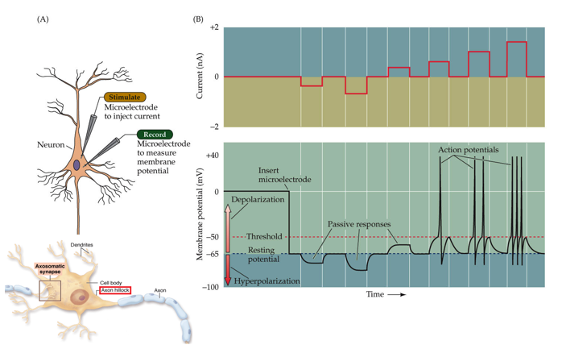

##### 静息电位 Resting Potential

研究材料：乌贼巨大轴突（1 mm）

静息电位的直接原因：膜内外离子浓度的显著差异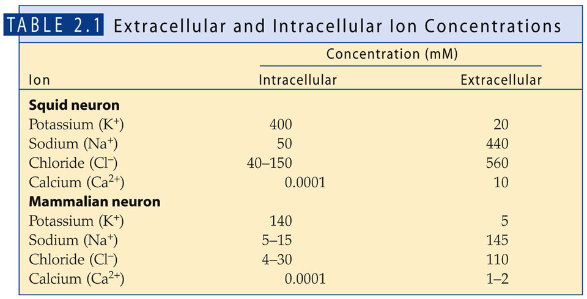

**钾离子是静息电位的决定因素，为什么？**

> 虽然膜内外有多种离子浓度差异，但是我们都说钾离子是静息电位的决定因素，这怎么理解？
>
> 从实验现象上来说，改变细胞外溶液的离子浓度（加入中性盐，不会直接影响膜电位的测量），发现只有[K+]会使膜电位明显变化，而[Cl-], [Na+]等都不行。
>
> 从原理上说，这说明静息膜对K+有一定通透性。正是由于钾离子可以进出静息膜，才有可能导致静息电位的变化。这也就说明钾离子是静息电位的决定因素。

**Nernst方程：**物理化学中解释半透膜内外平衡电势差的方程（推导忘了，PPT上使用功平衡推导？）

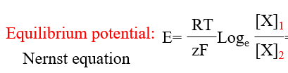

考虑离子通透性作为校正参数（P为电导）后形成Goldman Equation：

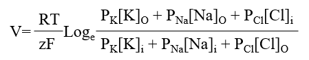

根据这个方程计算，静息膜电位也确实接近钾离子的平衡电位（当然不等同，还有其他离子）

##### 被动膜电位 Passive Membrane Potential

在轴突外施加较小的方波, 使膜电位变化但不引起动作电位。静息电位的变化并非是完全与方波相同，而是具有一定时空分布特征，这就是被动膜电位。它展示了膜被动的电传导特征：

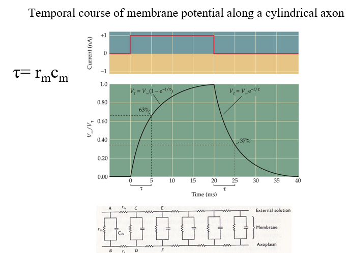

给静息膜施加固定电压，观察膜电位的变化，而当膜电位达到外电压时突然停止加电压，可以看到膜电位的时间变化，并对应**时间常数(Time Constant, τ)**。可以使用膜的电路模型理解计算时间常数（$c_m$为膜电容）。

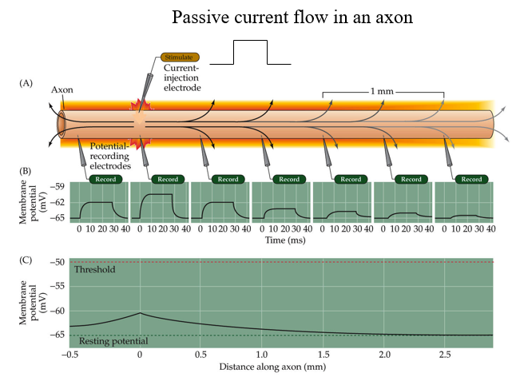

而若施加短促脉冲刺激，可以看到被动电位在空间上连续产生（形如最下边的图），但是随距离衰减。当电压衰减到峰值的37%时对应的距离，叫做神经元的**空间常数（length constant, λ）**。空间常数大，代表神经元的传导性好，在产生动作电位时也可以以更远的间隔触发下一次动作电位，传导快。空间常数也可以用静息膜的电路模型解释：

$\lambda=\sqrt{{r_m}\over{r_o+r_i}}$

> 髓鞘和郎飞氏结的结构就是提高空间常数的手段

##### 动作电位 Action Potential

下图为一个典型的神经细胞动作电位时相：

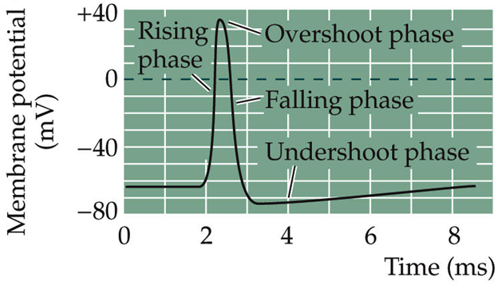

**分时相分析：**

1. 去极化：膜电位升高到0以上peak。参考此前对静息电位决定离子的研究，我们认为只有钠离子和钙离子可能导致这种变化。改变胞外离子浓度观察peak，**发现钠离子是神经元去极化的决定性离子**，也就是说去极化时应该有钠离子通透（思路均与静息电位研究相同）。

   > 进一步验证：使用放射标记Na离子介导动作电位，观察电位变化和放射性分布。

   去极化的电位peak接近钠离子的平衡电位（根据Goldman方程，这表明此时Na+通透性非常高，权重最大）

   > 需要知道，动作电位的离子流动依赖膜内外离子浓度梯度，会造成一些影响但不会导致离子浓度差的显著变化（因为是局部的微小反应）。所以各种离子的平衡电位是基本稳定的。

2. 复极化：膜电位从peak下降恢复到resting potential附近。由于回到了静息电位（钾离子平衡电位），很容易认为这又是钾离子主导的过程，也就是Goldman方程中钾离子通透性增加占主导。

3. 超级化：电势低于静息电位的阶段。具有这个阶段是因为voltage-gated钾离子通道没有完全关闭，细胞膜对钾离子的通透性高于静息状态，因此膜电位更接近钾离子的平衡电位（比静息电位更负）。后续在Na-K Pump的调节下回到静息电位。

**使用Voltage Clamp技术figure out动作电位膜生理：**

之前的电极只能测量膜内外的电压差，但是电压钳(Voltage Clamp)可以直接测量透过膜的电流（它主动施加一个反向电流，当电势平衡时反向电流=透过电流）。通过Voltage Clamp可以直接观测离子流动（条件为恒定电势差）。

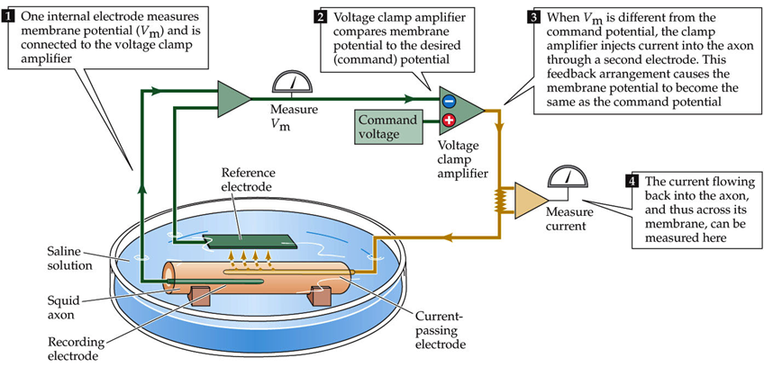

> 有了电压钳以后，我们能更确切的观察薄膜的电生理。例如，给膜施加一个恒定电势差，会出现一个瞬间电流脉冲（超级化电压向内，去极化电压向外），这是膜的**电容电流**（Capacitive Current），表明膜自身有一定的电容性质（这个脉冲电流不是内外离子流通导致的）
>
> 而给膜施加足够大的电势差，达到动作电位阈值时，会出现自发电流变化。这个过程是与之前观测到的电压变化可以对应的（先去极化再复极化），它也比电压变化更富有细节。
>
> 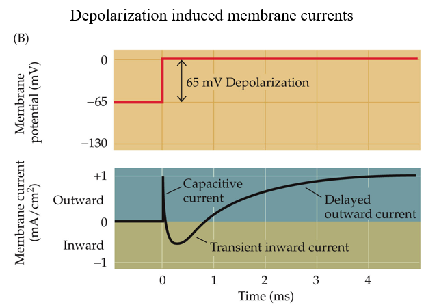
>
> 外部恒电压不同时，电流表现也不同。**种种迹象**似乎暗示，这个过程包含钠离子内流和钾离子外流。（迹象：电势差接近钠离子平衡电势差时，内向电流消失）
>
> 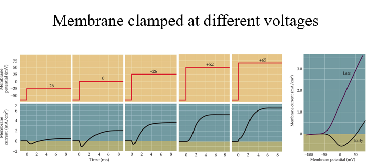

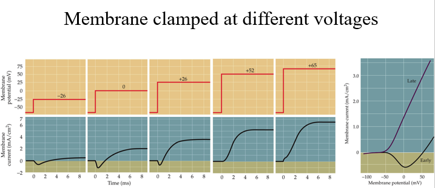

根据一定的假设，可以通过**钠离子替代实验**（使用不能透过细胞膜的阳离子替代）的数据分别计算出钠离子电流和钾离子电流，再根据电位信息计算出电导。也就是可以计算出膜对钠离子、钾离子通透性的变化过程（与时间和电压相关）。

> 也可以使用一些离子通道阻断剂来分别研究离子通透性，例如使用TTX阻断钠离子通道，TEA阻断钾离子通道。

**动作电位的电路模型：**

具有可变的膜电导和固定的leaky current，内外电压固定

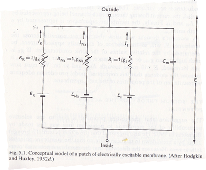

##### 离子通道的电压响应与失活

门控离子通道开放一段时间后会自然失活（Inactivation），并在一段时间内无法再次开启。**离子通道的复活（Deinactivation）需要一个接近静息的电位信号**，也就是说复活也需要特殊的电压信息。

实现电压门控**钠离子通道失活**与复活的结构基础大概是“门+塞子“模型。门A（activation gate）受到膜电压调控，达到阈值就开启，否则关闭；而门B（Inactivation Gate）关闭后需要受到静息电位刺激才会开启。

而钾离子通道只有门A，但反应比较慢

> **辨析：**
>
> Activation-Deactivation：是门A的行为。Activation是门A受到阈电压刺激开启，Deactivation是门A受到低电压刺激关闭。
>
> Inactivation-Deinactivation：是门B的行为。Inactivation是门B受高电压刺激关闭，Deinactivation是门B受到静息电位刺激开启。

门B关闭（Inactivation）在门A关闭（Deactivation）之前，如何观测到门

A的关闭？——在门B关闭以前突降电压。

**绝对不应期**：指Inactivation Gate关闭的阶段，刺激不能使钠离子通道开启，必须先回到静息电位才可以开启。

**相对不应期（Refractory Period）**：指超级化阶段（例如动作电位中的超级化，注意此时已经过了绝对不应期），需要更大的电位差（刺激）才能达到阈电位。

##### Hodgkin-Huxley Equation

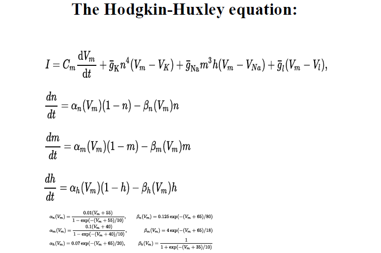

使用一组微分方程，定量描述动作电位的电流变化。方程包含：

1）电压变化时，细胞膜电容的放电效果；2）钾离子电流（平均电导常数，驱动电压+一个可以描述钾离子通道的函数的四次方，这个函数可以用微分方程解出来）；3）钠离子电流（门A的三次方和门B的一次方）；4）leaky电流

> 生理过程的数理建模，经过手打计算器验证可靠（怎么验证的呢？？）
>
> 总的来说是非常exciting的结果，毕竟单纯基于生理制作了有效的数理模型，好比是生命逻辑化的第一步
>
> 为什么是4次方？他们最初是通过数学特征猜测幂次，后来根据这个幂次提出模型，也许是有4个电荷敏感的感应系统。（通过电生理特征就可以制作模型了，tql）
>
> 

##### Patch-Clamp Recording

神奇的膜片钳技术，可以记录单个离子通道的信号

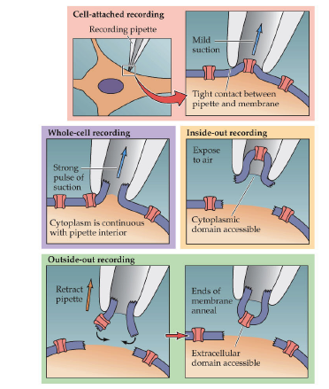

##### 离子通道的结构

钾离子通道选择性的基础：直径较大的钾离子可以与通道壁的氨基酸残基结合脱水，而钠离子不可以。

##### 总结

> 研究进展：
>
> - 玻璃微电极：电势差阶段
>   - 动作电位时相图
>   - 电化学势平衡方程
>   - 细胞膜横向传导的电路特征
> - 电压钳技术：电流阶段
>   - 电流分析，离子确定
>   - 内向和外向电流
>   - 细胞膜纵向传导的电路特征

#### 突触与信号传递

