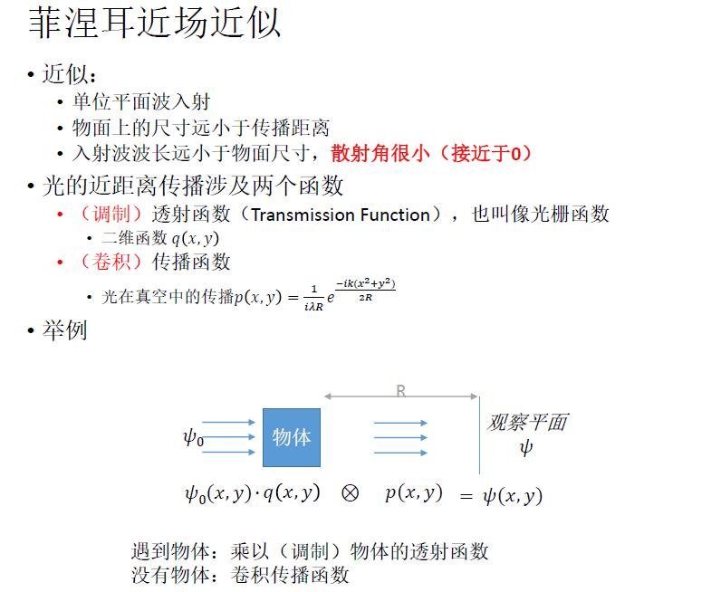
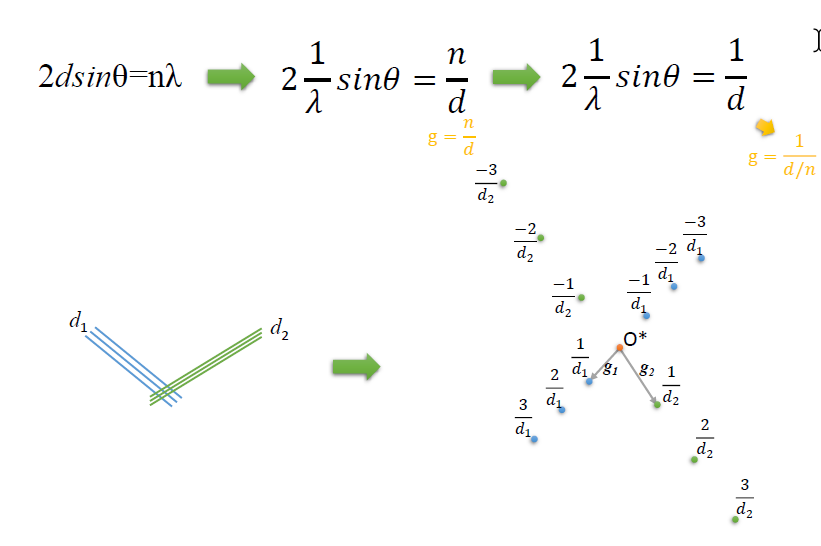

## 冷冻电镜三维重构技术与方法

Pro：李雪明

考核：平时成绩+考试（发题目回答，注重理解）

[TOC]

### 绪论

#### 电子显微学简介

- 光学显微原理，衍射极限和物质波（略）
	
	
	
	> 衍射极限的解释：为什么物点经过透镜成像会形成衍射斑？
	> - 理解1：透镜“不够大”，不足以获得物点投影的全部光学信息，使得光学系统输出的精确度下降（这可以解释为什么分辨率公式里有孔径角$\alpha$）
	> - 理解2：透镜成像原理依赖折射，折射现象与波长和介质折射率有关，这决定了它是光学低通滤波器（电磁透镜类似），会分离物点的高低频率信号（例如倏逝波）。这可以解释为什么分辨率公式里有波长$\lambda$（信源的分布特征）以及介质折射率n（滤波效果的影响因素）
	>
	
- 电镜系统简述：

  光源（电子束+电磁透镜）+样品+成像系统（电磁透镜）+传感器

  > 电子束：同时考虑亮度和相干性
  >
  > 电磁透镜原理（略，可以百度）

- 电镜结果分析：

  电子显微镜可以为我们展示丰富的信息，这在冷冻电镜中其实指应用了一小部分。从最早的利用电子进行的成分能态分析，到根据衍射相衬和衍射图谱做出的晶体结构分析，电镜的分辨率不断提高（已经达到亚埃级别），配套技术不断升级（像差校正系统），信息维度不断加深（样品结构、应力、温度、电磁场等）。

  > **晶体衍射分析举例：**
  >
  > 
  >
  > 上图为布拉格衍射示意（经典波动光学分析）。晶体样本具有周期性结构，可以看做以d为周期的反射屏（d比如说是原子间距）；这样相邻的两个反射光具有一定的光程差（依赖与d和入射角θ）；如果入射光的波长和光栅周期近似（比如一般晶体和X射线），符合波动光学的衍射模型，就会出现衍射条纹（因为入射角θ的变化产生不同的干涉效应），干涉相长点对应光程差是波长的整数倍。换言之，在波长扫描时根据出现布拉格衍射现象时对应的波长，可以反推出晶体的周期参数d。
  >
  > **图像直接观察：**形成我们可以直观感受的像（How？）
  >
  > **衍射分析：**通过衍射图样得到样品的某些信息
  >
  > **谱分析（成分分析）：**通过电子能量损失谱（EELS谱）可以分析样品原子的种类及状态

- TEM和SEM：透射像/反射像，TEM分辨率更高（埃级别）; cyro-EM基于TEM
#### 冷冻电镜的出现和发展

- 技术与原理预备：

  - 非晶态冰的发现与制备技术（1984，难点）：在nm级孔径（比表面积大，快速传热）的碳网薄膜上沾样品蛋白溶液，放在液态乙烷（比热容大，快速冷却）中**快速冻结**；如果是**细胞或组织样品**，就需要**冷冻切片**（金刚石刀50 nm左右厚度；**聚焦离子束**FIB平滑切片）；也有使用薄膜封闭细胞溶液观察的方法

    

  - 重金属负染技术

  - 中心截面定理（从二维图像重构三维结构的数学基础）

  - 液氮冷阱：为了制造低温、真空且洁净的环境，冷冻电镜会在样品台处使用液氮冷却、铜丝组成的冷容器，着使得冷冻电镜的**物距**与一般电镜有较大差别，光学性能也会略差

    

- 1980年以后，使用冷冻电镜观察生物样品成为可能，分辨率达到纳米级别；2013年左右，相机和衍射图像处理算法的进步使得冷冻电镜的分辨率达到了0.1 nm的水平，接近原子分辨率。目前冷冻电镜分辨率的极限随样品制备方式不同，最高是晶体形式（原子级, 1.5 A左右），单颗粒技术略低（1-3 A，可以看到氨基酸侧链，二级结构等），最低的是冷冻切片（1 nm水平，大概只能看出一些亚细胞结构）。

- 期望：分辨率；动态；在体……

--------------------

### 电子光学基础

#### 电子几何光学和像衬理论

##### 电子几何光学基础

- 物质波不是常见的波，它是统计意义的概念

- 波的**相干性**：相干波要求有固定的相位差，这一般意味着：

  - 相同的周期/频率
  - 固定的起始相位差

  无限小单色点光源发射的光就具有完全相干性

- 平行光束：一系列传播方向相同，且在垂直于传播方向平面上的相位相同（也就是在传播方向可以相干）的波

- 理想透镜成像公式和几何作图

- **Abbe成像原理**

  

  1. 平行光在样品处发生散射（衍射）：样品是具有厚度的多个平面，不妨以晶体为例，则其符合布拉格衍射模型。如果入射光是波长一定的完全相干光，则根据布拉格衍射波长、晶面周期和衍射角的关系，**衍射角（散射角）是样品结构的函数**。

  2. 散射光经透镜成像（就是一般的成像原理，物点与像点一一对应）

  3. 散射光经透镜在后焦面形成衍射图样：散射光可以看成多种角度的平行光的集合，而所有同一角度的平行光都会汇聚在焦平面上的同一点（经过透镜中心，以入射角为方向的直线与后焦面的交点），这样透镜实际上根据入射角分离了样品的散射光，**衍射图样上的每一点对应一种散射角的方向。亦即：衍射图样=f（散射角）=f（f（结构））**。

     衍射图样的中心对称性显然来自样品晶面作为平面模型的对称性。

  4. 当平行光入射方向变化（而已知）时，散射角也会变化，布拉格衍射的现象会变化（会形成不同的衍射条纹），其散射光的图样也会变化（衍射图样明暗分布变化）

##### 电子显微镜的光路和元件

抽象来说，电镜的一般系统包含光源（电子源、聚光镜+光阑）、物镜系统（物体和物像）、光阑（物镜光阑<滤波>）、放大透镜（放大物像，相当于目镜）、相机和观察区

> **光阑：**1） 改善光源平行度，它可以过滤周边显著不平行的光；2）只允许主光轴附近通光，这里的透镜更接近理想透镜，相当于减小了相差；3）减小了亮度
>
> **聚光镜系统：**C1可以使光源光尽量汇聚成点光源，C2则将这个点光源发散成平行光（C3如果存在，可以辅助C2）
>
> **放大系统：**放大系统的物平面放在物镜后焦面上就是衍射图谱，放在像平面上就是结构图谱
>
> 对于显微镜来说，**入射光**其实非常重要。**我们对样品的认识=我们对像的认识/我们对入射光的认识**。如果我们能全面解读像的信息，完全了解入射光的性质，就可以分析样品的所有信息（和光产生作用的部分）。在我们对像的理解有限的情况下（整个系统其实是把光投射成我们可以理解的像，像不会超过我们的认识范围，当然它本身也值得探索），入射光就是我们最值得探索和tricky的部分。电子显微镜、STORM、STED等，显然核心都是对入射光的处理。

##### 电子与物质的相互作用

冷冻电镜需要的信息都包含在弹性散射电子中，可以认为他们是入射电子撞击原子核后被弹射透过产生的，能量基本与入射电子相同，波长也就不变，既反映了原子位置信息，又保持了好的相干性。（相对的，与电子云作用的非弹性散射电子相干性差，成为图像噪音）

##### 像衬理论

电子显微镜形成的是黑白衬度图像，根据观察的目的和样品的特点，我们要选择不同的方法，以不同的成像原理形成不同的衬度像。了解这些成像原理，有助于我们采用合适的方法并读懂电镜图像。

###### 质厚衬度像

、、

非在样品和物镜之间加一个物镜光阑，进行散射角的限制。**样品厚/原子重/密度大**=散射角大=被阻挡多=像强度低≈图像上黑。这也是**原生光学显微镜**的主要成像原理。

质厚衬度的影响**在各种成像中都存在**，**样品越厚它的影响越明显**，它是一种非相干成像的现象。如果在其他成像方式中，不想受质厚衬度干扰，可以**减小物镜光阑**。

###### 衍射衬度像

是晶体由于布拉格周期不同形成的衬度差异。它是一种典型的**相干成像**，可以反映晶体的结构（或结构缺损）。我们会使用物镜光阑限制成像光（见下注释）, 形成**一束或者双束干涉**像。

> 明场像：具有中央明亮投射束的像，也泛指透射光成像（比如质厚衬度像）
>
> 暗场像：无投射束，仅衍射束成像

###### 相位衬度像

、/

相干成像，对光源相干性要求高（直接决定分辨率），可以看到埃米级的原子排布和晶体周期结构。当样品足够薄时，电子束通过以后**仅发生相位的变化**，并且发生**多束干涉**。图像需要经过处理后才可以观察。

#### 电子波动光学和傅里叶变换

##### 电子波

>  怎么理解波粒二象性和电子的物质波？(课程对此的一点理解)
>
> 一束电子具有波的特性，遵从态叠加原理等

> 波函数是量子力学的基本假设，它是时间t和空间位置r的函数，而$\omega$和k是波自身的特性（参数），因此波函数表示波的时空变化特征（概率幅，取模平方为**概率密度**），其中时空的项实际上形成一个无量纲量（**相位**），而A是归一化参数（概率的全空间积分应该是1），它形式上也恰好是**振幅**。

##### 电子波的传播性质

- 惠更斯原理：一个点波源，其波前上任意一点都可以看作一个新的点波源；某一点上的所有波由这些点波源发出的波叠加而成。

- 基尔霍夫公式：

- 菲涅尔近场近似：

  （常用于分析光学系统的微调和偏移）

  > 乘积与卷积具有傅里叶对称性。在一个空间里的卷积等于在另一个空间里的乘积。（也是计算卷积的一个方法）

  

- **夫琅禾费远场近似**：

  传播距离足够远（相比于波长）时，在传播过程中就具有傅里叶变换特征。

  

##### 傅里叶分析基础

> 级数：使用一系列基函数（函数列）的和表示一个复杂函数。常见的比如使用幂函数的Taylor级数，以及使用复指数函数的傅里叶级数。
>
> 傅里叶级数使用复指数函数为基函数，可以表示周期函数（或周期无限大的函数）。对于周期无限的函数而言，可以在一定的范围内选取有限的区间，如果在这个区间内可以实现比较好的收敛性质，那就不错了。因为选取这种有限区间以及有限项基函数，因此会有一些信息的损失，这就是截断效应。

傅里叶变换是基于傅里叶级数形式的空间变换。在A空间内有一个可用傅里叶级数表示的函数，根据AB空间的关系，**傅里叶变换**可以计算出该函数的傅里叶级数在B空间的**系数**，告诉我们这个函数在B空间的傅里叶级数形式（B空间就是以复指数函数为基的空间，也就是**傅里叶空间**）；而**傅里叶逆变换**是根据已知级数求原函数的过程。

> 傅里叶变换是很好的载体，它可以把复杂的函数转到其他空间，揭示同一现象的简单形式或不易察觉的性质。例如脉冲函数变成了均匀常数。
>
> 傅里叶空间为什么有这样有趣的性质？怎么理解透镜是光学傅里叶变换系统？

> 卷积是函数的乘法，在傅里叶光学中，一个很重要的概念是光学元件的点扩散函数（PSF）。成像就是光的函数与PSF 的卷积，或者说成像就是入射光函数的**卷积调制**过程。
>
> 卷积自然具有**模糊效应**。一个脉冲信号经过卷积会形成一段连续信号。

##### 衍射与傅里叶变换

在傅里叶光学中，傅里叶变换可以将波函数分解为一系列平面波函数（基函数）,实现了对光的分选，这就相当于一个透镜。类似地，我们有很多类比：

> 透镜=傅里叶变换器
>
> 后焦面=傅里叶空间
>
> 后焦面上的位置（散射角）=傅里叶系数

##### 常见的波函数

1. 宽度为a的狭缝（一维）

   经过傅里叶变换以后成为sinc函数。左上为原空间，右上为傅里叶空间的函数，右下是波函数的模平方（强度/功率）。可以看到，经过狭缝以后，发生一次傅里叶变换，光强具有非简单投影的特征。

   > 平移狭缝，像不会变化，这相当于傅里叶变换的平移性质（平移只改变相位，而平方后相位信息无了）

   

2. 二维函数（矩形/圆形）

   、

3. 两个窄狭缝（脉冲函数）

   （推导见PPT，运用了态叠加原理分别计算两个狭缝（脉冲函数），利用对称性简化计算）

   

4. 双缝干涉

   双脉冲函数与宽狭缝卷积（把宽狭缝当做PSF），也可以说是使用宽狭缝调制脉冲函数。

   > 

   

5. 无限的周期函数，其傅里叶变换是一系列脉冲函数（傅里叶变换可逆性）

6. 有限的周期函数，其相当于一个无限周期函数经过一个方波的调制（乘法），所以它的傅里叶变换就是脉冲函数与单缝衍射的卷积。

   > 应用上，这表明晶体越大（周期越多），越容易解结构（能观察到更多脉冲函数）

   

##### 电镜成像过程的波函数描述

> 平面入射波（1）经过很薄，只发生相位变化而不吸收能量的**相位物体**的散射（乘），经过物镜达到后焦面（像光栅函数的傅里叶变换）,再经过传播（第二次傅里叶变换，夫琅禾费衍射）在像平面成像。

#### 相位衬度成像

相位衬度成像是电镜成像的主要方式

##### 相位物体与成像的基本思路——如何制造相位衬度？

相位物体就是足够薄的物体，我们认为光穿过它以后仅发生相位变化，而没有强度的吸收。它可以使用一个像光栅函数（也可以叫做物体势场，二维二元）简单表示。如果它更薄，达到弱相位物体的程度，则可以简化方程。

光透过相位物体时是不可以直接产生衬度差异的，因为成像功率（取模平方）损失了相位信息。我们必须使用一些光学元件，使波函数发生一次实部-虚部的转化（实部加上一个i，或者虚部去掉i，相当于旋转90度，也相当于相位改变π/2），**这样就可以把相位差转化为相位衬度**。在散射波函数中，**实部对应透射束，虚部对应衍射束**，我们只需要将其中一个的相位变换π/2即可。

这不禁使我们想到相差显微镜的相位板。变换相位的方式有很多，首先要分离实部和虚部，然后可以使用电磁场或者衍射薄膜改变实部或者虚部的相位。例如，一种方法是利用透射束和衍射束的强度差异，激发薄膜的不同电场，反馈引发相位变化；或者利用相差的效应在后焦面引入相位变化。

##### 像差与衬度传递函数（CTF）

成像偏离模型中理想成像的部分叫做像差。在显微镜中，我们把所有像差归结到物镜--后焦面上，产生一个描述成像偏离理想成像的函数，即相位衬度函数。它相当于在后焦面（倒易空间）中对理想像的调制方法。

CTF包含振幅项和相位项。相位项由相差引起，它可以引起相位衬度；而振幅项描述光能量和信号强度的衰减。

像差在分析中要注意/避免，但是如果数据可以处理，我们可以反过来利用像差分离透射光和衍射光，产生相位衬度。

##### CTF的影响因素

> 这里的CTF是针对后焦面衍射图谱的CTF。

1. 离焦，指实际成像面和观察面不重合的情况。它可能由物距和像距的不协调导致（过焦和欠焦）。离焦会影响CTF中的相位项$\kai$,其中u、v是后焦面上的坐标，。$\Delta{f}$是物距和焦距的差（我们可以控制）。为了产生相位衬度，我们需要控制离焦效应，一般会调节成欠焦的状态。

   > 分析方法：几何光学（大物）和波动光学都可以解释，见PPT

2. 球差，由于物镜曲率具有的像差，它也是相位项的影响因素。

3. 振幅项（包络函数）中也包含相差、色差和束发散角等，影响因素很复杂。所幸我们只需要保证振幅不衰减至不可检测即可。

##### 衍射/像强度计算与像差纠正原理

> 衍射图像的分辨率很高，因此简陋的显微镜也可以分析晶体结构

> 我们也可以给像总结出一个CTF，它决定了我们可以直接观察到的相位衬度，这个CTF与上述衍射图的CTF有所不同。
>
> 电镜的像需要经过傅里叶变换处理，以去除CTF相位项卷积的调制效果（变为乘法调制，我们可以理解）。

##### CTF对信号的影响

仅就像的CTF而言，根据像的CTF公式，可以看出CTF的具体影响效应：

- 影响与波长有关，由于相位项的存在有周期性变化
- 总的来说频率越高信号越微弱（低通滤波）
- 会使部分频率的信号变成反的。在图示的参数条件下，主峰（第一段最强的信号）就是负的。（图像上原子处有时为暗，有时为明）

1. **点分辨率的计算：**

2. 在操作中，我们容易改变物距（离焦程度）以改变成像情况。考虑**${\Delta}f$对像的影响**：

	- 离焦越多（绝对值，包含欠焦和过焦），低频滤波效果越好，反之低频信号会较多被过滤。在生物学研究中，我们更倾向于观察低频信号，因此会使用较大的欠焦（μm级别）
	- 离焦越多，信号震荡越快，解析图像会更加复杂困难。
	- 离焦多时，分辨率降低。

3. **加速电压的影响：**

   电压越高，通频带越宽，分辨率越高。

4. **球差的影响**：

   球差越大，分辨率越低。比较流行的是尽量降低球差。

##### 信息分辨极限

在生物观察中，比起点分辨率，我们更关注的是CTF决定的**信息分辨极限**

信息分辨极限由包络函数决定。当信号强度为max的1/e时对应的波长就是信息分辨极限，它决定多少波长范围的光是我们可以观察的。

信息分辨极限受到像差、色差等影响。

> 究竟如何调节参数，改善系统？
>
> 低电压，大球差，大离焦 => 好的衬度（对比度），少的信息（衍射小，穿透力弱，信息分辨率低等）
>
> 高电压，小球差，小离焦，大照明面积和无色差 => 好的信息分辨极限，低衬度（对比度低）
>
> 其中有一些矛盾点：
>
> - 高频和低频信号：观察生物样本时，我们可能期待更多的低频信息，因为它比较可以反映样品结构，而高频信号具有更多的细节和噪音。所以我们会选择**高欠焦**
> - 为了获得更好的包络函数性质和信息分辨率，我们又要选择尽可能的**高电压**（当然低压电镜成本比较低）
>
> 电镜参数的调节就需要调和这种矛盾。当然了，对于一台电镜，电压是固定的，而色差、球差等可以使用一些元件调节，**最容易调整的就是离焦。**
>
> 对于同样的欠焦量，电压越低衬度越好。反之，要获得同样的衬度，高电压就需要用更大的欠焦。

### 图像数字化及基本分析技术

#### 数字图像基础

计算机对数字图像的存储和处理原理也是我们需要考虑的因素。它会包含在protocol中，也是debug需要考虑的。

- 离散数字信号与像素：离散化存储会导致一定的误差，在有些时候会给分析带来困难（比如降低了对比度等）
- 存储范围（图像的位数）：如果亮度超过存储范围（动态范围）会溢出
- 图像压缩和格式转换
- 灰度调整：人眼能辨别大约 60 个灰度级，常把图像在最大值和最小值区间内分割为 256 个灰度级

#### 采样定理与快速傅里叶变换

##### Nyquist 采样定理

模拟转数字，必然有一些信号变化和损失。采样越密集，数字信号越接近模拟信号的真实。奈奎斯特采样定理提出：<u>**当信号的采样频率大于信号最高频率（图像分辨率）的两倍时，信号中的信息能被完整保留**</u>，图像所能保存的完整信息最大频率**（Nyquist频率）**是像素大小的两倍。

这意味着采样频率、像素大小与信息分辨率挂钩。足够小的像素（大采样频率）才能展示足够好的分辨率（表现为Nyquist频率），它是倒易空间中的分辨率。

##### 快速傅里叶变换（ FFT ）

计算机处理数字图像，使用的一定是离散傅里叶变换，而快速傅里叶变换（FFT）是离散傅里叶变换的一种算法。

基本特征（处理效果，不代表运算过程）：无限扩展：由于傅里叶变换针对无限周期函数，我们需要把有限的函数无限重复扩展成为周期函数，运算后截取原有限函数对应大小的结果。而这一般会导致边界跳跃。

##### 像素大小的问题

**实空间中的像素大小决定了倒易空间中的采样频率（Nyquist频率），最大分辨率定义为Nyquist频率的倒数。**

**如何计算像素大小——使用已知晶格常数的标准样品。**

例如，-185℃时，冰（六方晶系） 的晶格常数为4.4930埃。我们从冰的图像中选取一个像素群（例如4096*4096个）进行傅里叶变换，从衍射图像里测量晶格常数对应的像素个数，可以得到倒易空间中的像素大小，继而计算得到实空间中的像素大小。

**像素大小的影响：**混叠：我们知道CTF具有振荡的性质（振幅项）。如果采样频率不足，同一个像素点里有两个及以上的peak，这个像素点的信号强度会难以解析。实际上必须使Thon RIng的最小间距大于两个像素（减小像素大小，或者调整离焦）。（图中本来只应该有一个衍射环）

##### 图像处理：平移与缩放

由于像素储存是离散化的，如果平移了非整数个像素的距离，就会导致一个像素的信息呗分摊到若干个新像素里，产生插值。插值会模糊图像，降低分辨率。

一种无损平移的方法是，利用傅里叶变换的无损和相位变化性质。先对图像做傅里叶变换，再调整图像的相位（平移），逆傅里叶变换的结果是原图像的无损平移。

> 为了防止平移后超越像素数量的边界，并由于傅里叶周期性产生奇怪的位移，一般会在图像周围加一些空白边距（窗函数），使图像在边缘迅速衰减。

有时候我们进行图像的缩放，它的基本算法是将相邻的一个像素群平均成一个像素（例如将2*2的像素变成一个，可以把边长均缩放一半）。这个算法也有导致混叠的风险（除非采样频率足够高）。这个过程在傅里叶空间中的解释如图：

>  采样点频率不足，卷积后经过PSF的调制，相邻采样点信号相互干扰

#### 理想相机的采样

模拟信号——依赖于像素大小的卷积（模糊化）——采样

这可能导致一些高频信号被混叠到低频图像里。

#### 图像质量提升

##### 衬度vs分辨率

> 
>
> 为什么说低频信号贡献轮廓，高频信号包含细节？从低通滤波的效应讲，低高频信号=小口径窗函数=实空间傅里叶变换扩散=少细节
>
> 从成像角度讲，高频信号不止包含细节，也包含很多噪音（比如热噪声）。我们希望可以通过图像处理的方法改善高低频信号关系。
>
> **谱信噪比**SSNR：信噪比对频率的函数。低频信号信噪比高，可以改善衬度；高频信号信噪比高；可以改善分辨率

##### 图像处理的方法

- 直方图调节
- 图像低通滤波算法

##### 基于CTF调整的成像方法

根据之前我们对CTF的认识，我们知道增大欠焦可以增加低频信号的强度并过滤高频信号，降低电压有类似效果。

##### 元件调节的方法

- 相机：刚才我们讨论了理想相机的成像原理，可以说只要是数字化图像探测（像素），就有卷积混叠效应；但是实际相机除了有以上效应以外，还存在其他限制。例如，一些相机与电子发生作用（感光材料/光电转换）时，由于探测时的随机效应，也会具有一个点扩散函数（称为调制传递函数MTF），产生混叠。使用相机摄录一个锐利的边缘，可以检测其MTF性质。

  

  此外，相机元件自身也会具有热噪音等误差。我们可以使用DQE（Detective Quantum Efficiency）总体评价相机性能。

  

  相机性能的改善：

  - 减小MTF：

  - 使用直接电子探测相机（K2）和电子计数技术

- 相位板

  在后焦面上加一个薄膜，可以滤波，起到改善衬度的效果，但是因为增加了元件，会提高高频信号的噪音并影响分辨率，所以逐渐不流行

- 球差矫正器

  可以将球差校正为0，影响CTF的性质，尤其是可以改善包络函数，提高信息通过率和分辨率。这对于高频信号（比如材料科学）是好消息，对生物样品则……

### 电子晶体学

虽然观察晶体和生物样本有许多差异，但是电子显微学滥觞于晶体学，了解电子晶体学原理有助于我们理解生物样品的观察

#### 晶体基本知识

晶体是原子周期性排列的模式。我们可以用6个参数描述晶胞的结构（空间点阵），再用xyz参数描述晶胞的周期性。

#### 倒易空间中的物体

在倒易空间中有与实空间中对应的物体。就晶体而言，倒易空间的晶体也有周期性我们也可以用六个参数+xyz描述。

实空间中的晶体与倒易空间中的有什么关系？

> - 实空间具有无限对称性，但傅里叶空间具有一个原点
>
> - 实空间与傅里叶空间的长度呈倒数关系（$\alpha*\alpha'=1$）
>
> - **傅里叶空间中的每一个点，对应实空间中的一组晶面:**
>
>   

#### 电子波

我们考虑一个晶面对入射光的散射：

> 推导过程如上图（从一个以A为核心的A-B组合，去中心化，再推广到n个点），最后我们得到了**结构因子的方程**，它代表我们已知晶面的空间位置和散射因子时，一定方向的入射光（平面波）经一个晶面散射后散射光的效应。我们可以看到它**具有傅里叶变换的形式**。
>
> 倒易矢量g，在实空间中代表入射光和衍射光的方向差异，在倒易空间中就是倒易点与原点的矢量。

我们再回顾布拉格衍射的情况：

> 可以看到, 布拉格衍射中，一定的干涉效应（例如干涉增强）对应了一定的晶面距离和倒易矢量。
>
> 如果我们在样品里找一个晶面，并控制发生布拉格衍射，可以认为这里发生布拉格衍射时的法线方向就是倒易矢量的方向，根据一次（n=1）布拉格衍射的角度对应的d可以计算g的模。（也可以知道，多次干涉形成的倒易点阵在同一个g的方向上）
>
> 

布拉格衍射的模型可以帮我们**直观地构建实空间和倒易空间的关系**。如果我们把物体看做许多布拉格衍射的组合，就可以还原出它的倒易物体。这种方法叫做**埃瓦尔德作图**：

> 一定波长的光是否发生布拉格衍射（产生倒易空间点）同时受到常数d和入射方向θ决定。反射球作图就是综合d和θ告诉我们是否能产生布拉格散射的判断方法（其实就是确定θ、λ和d是否满足布拉格散射条件的几何方法）：
>
> - 画出衍射晶面和散射光，同时确定d和θ，也确定了反射光方向
> - 在入射光延长线上，距离入射点距离为1/λ处确定点O，作为倒易原点。以入射点为球心，入射点与O点连线为半径做一个反射球。
> - 如果这个d-θ组合可以发生布拉格衍射，则应有：反射光线上、与O点距离为1/d的点位于反射球面上。

#### 电镜观察晶体

