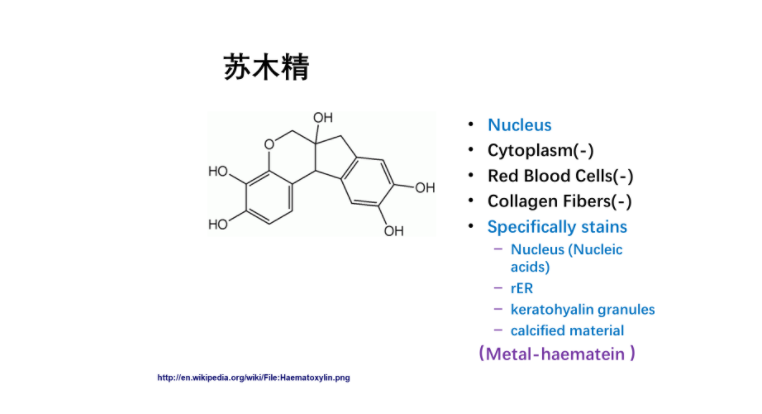

### 细胞生物学实验

#### 草蛇灰线

- 大气压强？
- 悬浊体系不稳定且无法搅拌？

#### 课程要求

- 不要求做实验记录，但是最好记一下现象、思考、发现等
- 实验报告图文并茂
- 在实验过程中保持环境、试剂等状态良好
- 实验室的课外开放时段，要准时。如果必要请额外预约
- 课前提前5min到教室，至少可以顺一下实验流程

#### 教学安排

- HeLa细胞传代以后需要定期到实验室观察
- 转染实验，操作部分会安排在实验前一天的早八

#### 实验报告要求

- 实验原理，以及一些特殊试剂等的特征，需要表在实验班背景中，或者在其他部分明确提及

  

  

#### 显微镜的使用

- 镜头（物镜）参数：放大倍数，数值孔径，焦深，工作距离，分辨率……
- 简单调节：合轴调节（将各个光学元件的光轴调节一致），屈光度调节（目镜上有适应双眼屈光度不同的调节旋钮）

- 光阑和聚光镜的使用

  一般光学显微镜具有两个光阑：视场光阑和孔径光阑。

  - 视场光阑在光源附近，不用时调至最大。它显然有调节光源强度和角度的作用。在目镜中，我们就可以看到视场光阑的投影。
  - 孔径光阑的数值孔径最好与物镜镜头对应（0.6-0.8倍），分辨效果最好
  - 调节聚光镜高度，使得聚光镜后焦面位于聚光镜上沿的1.5 mm处（样品处）。**在科勒照明中，聚光镜实际上将视场光阑成像在样品处**。
  - 孔径光阑在聚光镜下，不用时调至最小。一般看不到孔径光阑的像，除非摘除目镜。

  > 物镜倍数越高，视场光阑应小（视野小了），孔径光阑应大（与物镜镜头的数值孔径对应，0.6-0.8倍）。
  >
  > 调节视场光阑，会改变**视场范围**；调节孔径光阑，会改变光源的角度，即**入射光的孔径角和像面照度**。孔径光阑大，样品明亮，但杂散光多（频域集中化）；孔径光阑小，样品对比度高（质厚衬度效果强，频域分裂化），景深增加，但视场过暗，且会损失一些灰度信息。过大或过小都会影响分辨率。

  

- 相差板和环状光阑的使用
- 拍摄要点：
  - 构图
  - 对焦
  - 亮度和对比度
  - 后期处理：裁切和白平衡

#### HE染色

- 固定剂：可以固定细胞形态，提高细胞膜通透性。常用固定剂包括醇类和醛类。醛类固定剂对蛋白质的固定效果好（共价交联），但是改善通透性的效果不好（需要通透化处理）

- **碱性染料苏木精**染色：

  染液中包含**硫酸铝钾（媒染剂）和碘酸钠（催化剂）**。碘酸钠是强碱和氧化剂，它使苏木精去质子化并带负电，从而与金属离子（铝矾）结合，形成**金属苏木精（+）**，它可以与酸性物质（-）结合，例如**核酸**。

- **酸性染料伊红B**染色：

  

  需要注意，伊红染液使用酒精溶解，它对苏木精有一定脱色效果

  

- 分色处理：其实就是使用盐酸酒精溶液处理，部分洗脱染料，需要够快。我们在实验中使用流水代替。

